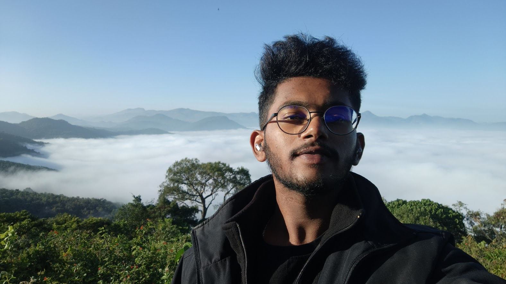

<html lang="en">
<head>
    <meta charset="UTF-8">
    <meta name="viewport" content="width=device-width, initial-scale=1.0">
    <title>Telu Thanmay Tej - Portfolio</title>
    <link rel="stylesheet" href="https://cdnjs.cloudflare.com/ajax/libs/font-awesome/6.4.0/css/all.min.css">
    
</head>
<body>
    <!-- Scroll to top button -->
    

        <i class="fas fa-arrow-up"></i>
    

    <!-- Toast notification -->
    

    <!-- Header & Navigation -->
    <header>
        

            
T.T.T

            

                <i class="fas fa-bars"></i>
            

            <ul class="nav-links">
                <li><a href="#home">Home</a></li>
                <li><a href="#about">About</a></li>
                <li><a href="#education">Education</a></li>
                <li><a href="#experience">Experience</a></li>
                <li><a href="#projects">Projects</a></li>
                <li><a href="#skills">Skills</a></li>
                <li><a href="#contact">Contact</a></li>
            </ul>
        

    </header>

    <!-- Hero Section -->
    <section id="home" class="hero">
        

            <h1 class="hero-title">Telu Thanmay Tej</h1>
            
Electronics and Computer Science Engineer   |  Full Stack Developer 

            

                <a href="#contact" class="btn"><i class="fas fa-paper-plane"></i>Get In Touch</a>
                <a href="#projects" class="btn btn-outline"><i class="fas fa-briefcase"></i>View Projects</a>
                <a href="#" class="btn btn-download" id="downloadResume"><i class="fas fa-download"></i>Download Resume</a>
            

        

        
        <!-- Floating Elements -->
        

            <!-- These will be generated by JavaScript -->
        

        
        <!-- Particle Background -->
        

    </section>

    <!-- About Section -->
    <section id="about" class="about">
        

            <h2 class="section-title">About Me</h2>
            

                

                    
I am a passionate Electronics and Computer Science Engineer with expertise in Full Stack Web Development. I enjoy creating innovative solutions to complex problems and continuously expanding my skill set.

                    
With experience in both front-end and back-end development, as well as data analysis and machine learning, I bring a unique perspective to technology projects.

                    
When I'm not coding, you can find me playing football, organizing events, or exploring new technologies.

                

                

                    
                

            

        

    </section>

    <!-- Education Section -->
    <section id="education" class="education">
        

            <h2 class="section-title">Education</h2>
            

                

                    
2025

                    <h3 class="education-degree">B.Tech in Electronics and Computer Science</h3>
                    
K.L University

                    
CGPA: 8.47

                

                

                    
2021

                    <h3 class="education-degree">Board of Intermediate Education</h3>
                    
FIITJEE International

                    
Percentage: 91.7%

                

                

                    
2019

                    <h3 class="education-degree">Board of Secondary Education</h3>
                    
Sri Chaitanya Techno School

                    
CGPA: 9.3

                

            

        

    </section>

    <!-- Experience Section -->
    <section id="experience" class="experience">
        

            <h2 class="section-title">Work Experience</h2>
            

                

                    
SEGURA INVENDORS

                    <h3 class="experience-role">Full Stack Web Developer Intern</h3>
                    
May-August 2023

                    
Worked on  Data retrieval API’s and and their properties such as retrieving weather data ,weather conditions in a particular place. Created a website 
"WEATHER REPORT" using the Weather API’s. Where we can give the cities names as inputs which will give the weather condition in that particular place.

                

                

                    
TECHNOHOOK

                    <h3 class="experience-role">Data Scientist Intern</h3>
                    
May-June 2024

                    
Various aspects of data analysis and modelling. This includes tasks like data collection, cleaning, and exploration to uncover patterns and insights. Application of  
statistical techniques and machine learning algorithms to build predictive models, while also learning about feature engineering and model evaluation. Additionally, 
gained exposure to big data technologies for handling large datasets and deploying models into production. Effective data visualization and communication skills are 
emphasized, along with collaboration within inter-disciplinary teams. Throughout, the focus was on practical experience and skill development in the diverse 
landscape of data science. 

                

            

        

    </section>

    <!-- Projects Section -->
    <section id="projects" class="projects">
        

            <h2 class="section-title">Projects</h2>
            

                

                    

                        
                    

                    

                        <h3 class="project-title">Administration System Django Full Stack Project</h3>
                        
March-April 2023

                        <ul>
                        
• Developed Django-based college administration website mirroring university's platform.

                        
• Student-focused features: Enrolment, course browsing, and fee details.

                        
• Faculty functionalities: Access to pertinent student and course info.

                        
• Ensured data security and privacy.

                        
• Conducted thorough testing and debugging.

                        </ul>
                    

                

                

                    

                        
                    

                    

                        <h3 class="project-title">Weather Conditions Display using API</h3>
                        
June-August 2023

                        <ul>
                        
• Developed a project aimed at displaying current weather conditions to users based on their location by utilizing a reliable weather API. 

                        
• Provides up-to-date information about atmospheric conditions for any given location.  

                        
• Utilized a weather API to provide accurate and up-to-date information about temperature, humidity, wind speed, and other relevant data. 

                        
• Leverages geolocation technology to detect the user's current location automatically, and then fetch real-time data from the selected API.

                        </ul>
                    

                

                

                    

                        
                    

                    

                        <h3 class="project-title">Automated Weed Detection using TensorFlow</h3>
                        
March-May 2024

                        <ul>
                            
• The Weed Detection project using an LSTM RNN (Long Short-Term Memory Recurrent Neural Network) with TensorFlow. 

                            
• Through the implementation of convolutional neural networks (CNNs) and deep learning techniques, developed a robust system capable of accurately 
identifying and classifying weeds in agricultural fields. 

• The main moto of this project is to show the integration of automation into weed detection offers numerous benefits to farmers in various ways.

                        </ul>
                    

                

                

                    

                        
                    

                    

                        <h3 class="project-title">Android Malware Detection using ML with Feature Selection based on Genetic Algorithm</h3>
                        
Feb - April 2025 

                        <ul>
                            
• Built a machine learning system to detect Android malware by analyzing app characteristics like permissions and network activity, enhancing mobile security.

                            
• Trained and compared multiple machine learning models (including Random Forest and Neural Networks) on this refined dataset to determine the best performer.

                            
• Significantly boosted detection accuracy and performance scores by using this smart feature selection method, outperforming the standard approach.

                            
• The final outcome was deployed through a webpage through with the app can be installed.

                            
• Developed a robust and efficient solution suitable for resource-constrained environments, contributing to advanced threat detection in mobile ecosystems

                        </ul>
                    

                

            

        

    </section>

    <!-- Skills Section -->
    <section id="skills" class="skills">
        

            <h2 class="section-title">Technical Skills</h2>
            

                

                    <h3 class="skill-title">Programming</h3>
                    <ul class="skill-list">
                        <li class="skill-item"><i class="fas fa-code"></i> Java</li>
                        <li class="skill-item"><i class="fas fa-code"></i> Python</li>
                        <li class="skill-item"><i class="fas fa-code"></i> HTML/CSS</li>
                        <li class="skill-item"><i class="fas fa-code"></i> C</li>
                        <li class="skill-item"><i class="fas fa-code"></i> JavaScript</li>
                        <li class="skill-item"><i class="fas fa-code"></i> SQL</li>
                    </ul>
                

                

                    <h3 class="skill-title">Libraries & Frameworks</h3>
                    <ul class="skill-list">
                        <li class="skill-item"><i class="fas fa-cogs"></i> Django</li>
                        <li class="skill-item"><i class="fas fa-cogs"></i> Pandas</li>
                        <li class="skill-item"><i class="fas fa-cogs"></i> Numpy</li>
                        <li class="skill-item"><i class="fas fa-cogs"></i> sklearn</li>
                        <li class="skill-item"><i class="fas fa-cogs"></i> Node.js</li>
                        <li class="skill-item"><i class="fas fa-cogs"></i> TensorFlow</li>
                    </ul>
                

                

                    <h3 class="skill-title">Tools & Software</h3>
                    <ul class="skill-list">
                        <li class="skill-item"><i class="fas fa-wrench"></i> PyCharm</li>
                        <li class="skill-item"><i class="fas fa-wrench"></i> VS Code</li>
                        <li class="skill-item"><i class="fas fa-wrench"></i> Eclipse</li>
                        <li class="skill-item"><i class="fas fa-wrench"></i> PostgreSQL</li>
                        <li class="skill-item"><i class="fas fa-wrench"></i> MongoDB</li>
                        <li class="skill-item"><i class="fas fa-wrench"></i> LaTeX</li>
                        <li class="skill-item"><i class="fas fa-wrench"></i> Photoshop</li>
                    </ul>
                

                

                    <h3 class="skill-title">Certifications & Languages</h3>
                    <ul class="skill-list">
                        <li class="skill-item"><i class="fas fa-certificate"></i> Embedded and IoT Training (IBM Global Certification)</li>
                        <li class="skill-item"><i class="fas fa-certificate"></i> AI & ML using Python (Tessolve Global certification) </li>
                        <li class="skill-item"><i class="fas fa-certificate"></i> Embedded and IoT Systems (Tessolve Global certification) </li>
                        <li class="skill-item"><i class="fas fa-language"></i> English</li>
                        <li class="skill-item"><i class="fas fa-language"></i> Telugu</li>
                        <li class="skill-item"><i class="fas fa-language"></i> Hindi</li>
                    </ul>
                

            

        

    </section>

    <!-- Contact Section -->
    <section id="contact" class="contact">
        

            <h2 class="section-title">Contact Me</h2>
            

                

                    

                        <i class="fas fa-envelope"></i>
                        
thanmaytejtelu@gmail.com

                    

                    

                        <i class="fas fa-phone"></i>
                        
+91 7207507250

                    

                    

                        <i class="fas fa-map-marker-alt"></i>
                        
24-1-71/1, Sambamurthy Road, Durgapuram, Vijayawada, A.P, India

                    

                    

                        <i class="fas fa-globe"></i>
                        
Available for freelance work and full-time opportunities

                    

                

            

        

    </section>

    <!-- Footer -->
    <footer>
        

            
Telu Thanmay Tej

            

                <a href="https://www.linkedin.com/in/thanmaytej/" target="_blank"><i class="fab fa-linkedin"></i></a>
                <a href="#"><i class="fab fa-github"></i></a>
                <a href="#"><i class="fab fa-twitter"></i></a>
                <a href="https://www.instagram.com/__threet__/" target="_blank"><i class="fab fa-instagram"></i></a>
            

            

                &copy; 2025 Telu Thanmay Tej. All Rights Reserved.
            

        

    </footer>

    <!-- JavaScript -->
    
</body>
</html>
